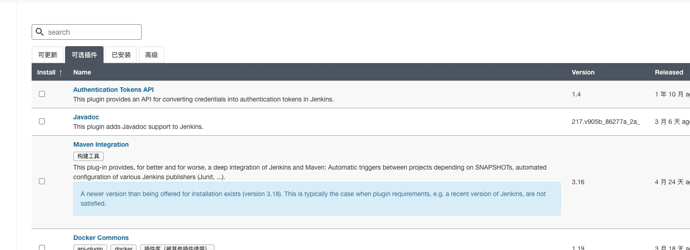
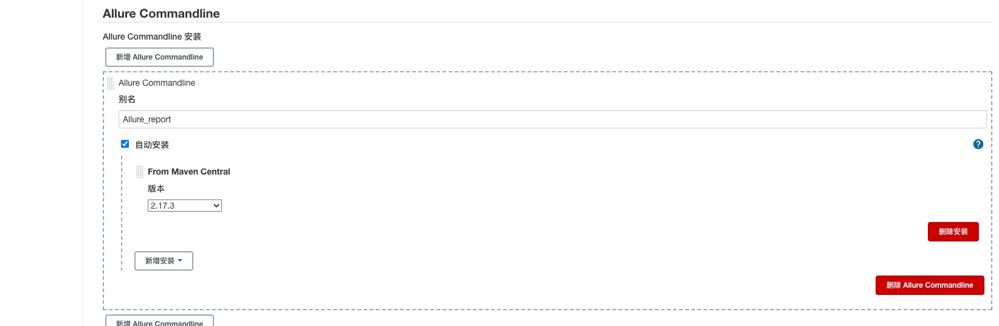
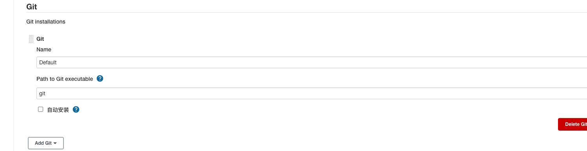

# 持续集成的配置
## 一、Jenkins和Docker的安装

Dcoker桌面版安装：
https://www.runoob.com/docker/macos-docker-install.html

Docker版本的Jenkins镜像：
https://hub.docker.com/r/jenkins/jenkins

复制以下命令：
docker pull jenkins/jenkins:lts-jdk11

在终端执行一下命令，进行镜像文件安装：
docker pull jenkins/jenkins:lts-jdk11

加快docker镜像拉取速度
{
  "debug": true,
  "experimental": false,
  "registry-mirrors": [
    "https://e29lwva9.mirror.aliyuncs.com"
  ]
}

启动命令：
docker run -d -p 80:8080 -p 50000:50000 -v jenkins:/var/jenkins_home -v /etc/localtime:/etc/localtime --name jenkins docker.io/jenkins/jenkins:lts

访问Jenkins：
localhost：80

## 二、Jenkins插件的安装和配置
### 插件安装

allure插件安装

1、进入jenkins->系统管理->插件管理->可选插件

2、搜索框中输入allure->选中点击"直接安装"->安装完成，重启jenkins

git插件安装

1、进入jenkins->系统管理->插件管理->可选插件

2、搜索框中输入git->选中点击"直接安装"->安装完成，重启jenkins

### 插件配置
alluer插件配置

1、进入jenkins->全局工具配置->Allure Commandline

git插件配置

1、进入jenkins->全局工具配置->Git

## 三、项目配置

新建节点

运行节点：
java -jar agent.jar -jnlpUrl http://10.20.64.44/computer/Test%5FEnv/jenkins-agent.jnlp -secret 4567a083f7ce4e8ed3c4a4c3fbc069a9ce9d7b3651efbcad9eaf3b88769e33ac -workDir "/Users/xxx/jenkins-data"

注：需要讲agent.jar放在jenkins工作目录下

